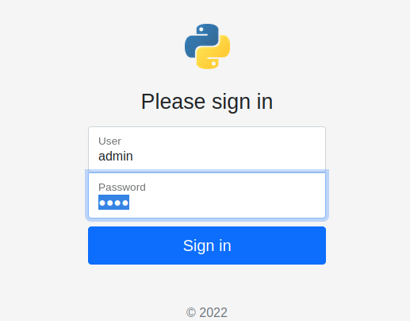
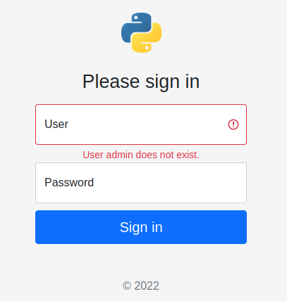
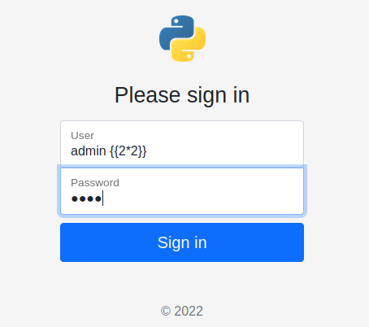
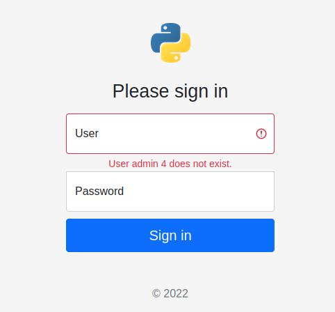
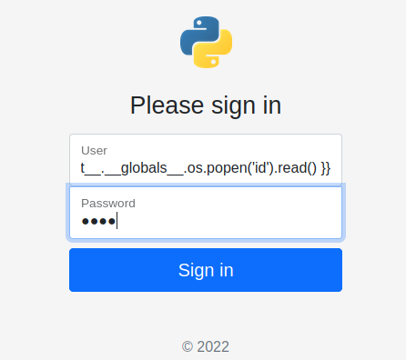
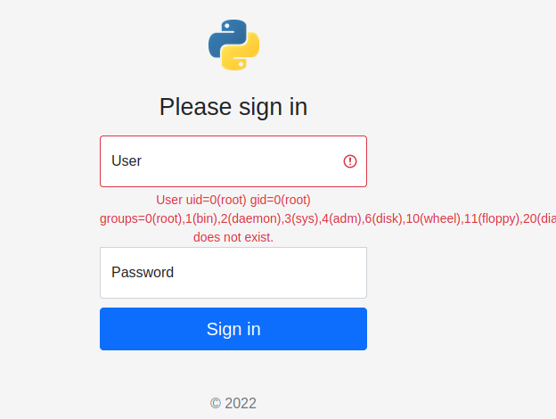

# Server-Side Template Injection flask project

## Quick start with Docker
1. Execute docker
```sh
docker-compose up
```
2. Open a browser in http://localhost:80

3. Start hacking


## Some pictures












